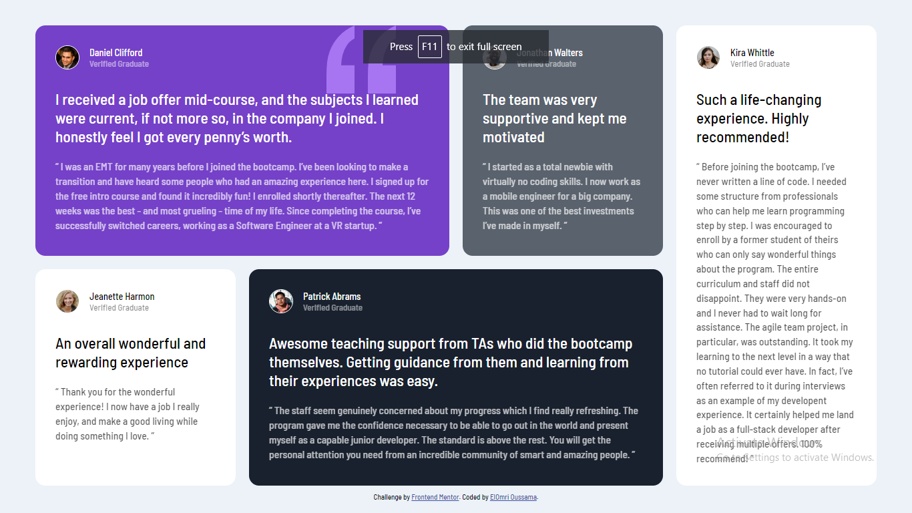

# Frontend Mentor - Testimonials grid section solution

This is a solution to the [Testimonials grid section challenge on Frontend Mentor](https://www.frontendmentor.io/challenges/testimonials-grid-section-Nnw6J7Un7). Frontend Mentor challenges help me improve my coding skills by building realistic projects. 

## Table of contents

- [Overview](#overview)
  - [Screenshot](#screenshot)
- [My process](#my-process)
  - [Built with](#built-with)
- [Author](#author)

### Screenshot

### Links

- Solution URL: [Github](https://github.com/oussamaelomri/testimonials-grid-section-main)
- Live Site URL: [Live]()

## My process

### Built with

- Semantic HTML5 markup
- CSS custom properties
- CSS Grid

## Author

- Frontend Mentor - [@ElOmri Oussama](https://www.frontendmentor.io/profile/oussamaelomri)